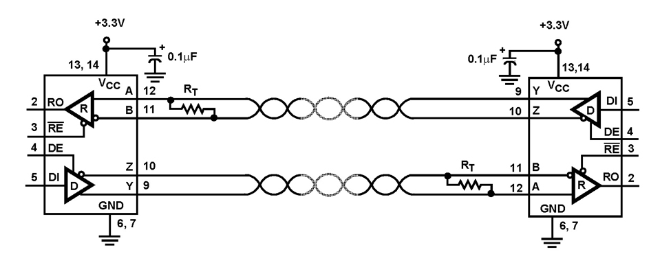
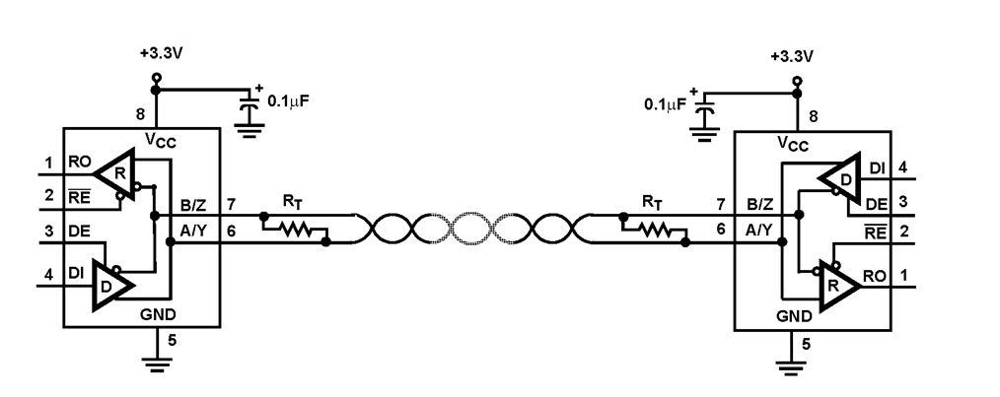

# Serial To Network (Industrial Gateway)

RS422:

* [RS422 wikipedia](https://en.wikipedia.org/wiki/RS-422)

RS485:

* [RS485 wikipedia](https://en.wikipedia.org/wiki/RS-485)
* [RS-485 Serial Interface Explained](https://www.cuidevices.com/blog/rs-485-serial-interface-explained)

### RS485

### socker programming with c
* [geeksforgeeks](https://www.geeksforgeeks.org/socket-programming-cc/)
